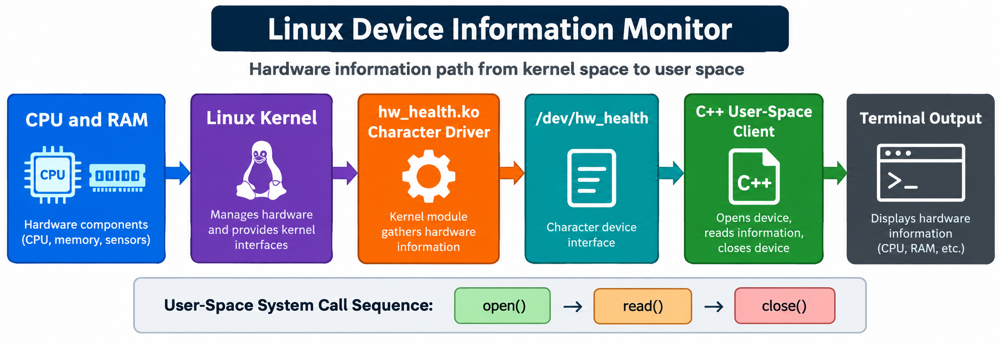

# Linux Device Information Monitor

**Individual capstone project — Linux, device drivers, system programming, and C++**

## 1. Project introduction

Linux Device Information Monitor is a Linux-based command-line application that collects CPU, memory, and system uptime information through a custom Linux character device. The kernel module registers `/dev/hw_health` and provides a read-only interface between the Linux kernel and the C++ user-space application. The C++ program opens the device, reads the formatted information using the POSIX `open()` and `read()` system calls, processes the received data, and displays a clear system-information report in the terminal.

The project demonstrates how kernel-level system information can be accessed by a user-space program through a device-driver interface. It covers Linux kernel modules, character devices, file operations, system calls, kernel-space and user-space communication, C++ programming, and basic error handling.

## 2. Features

- A Linux miscellaneous character-device driver that registers `/dev/hw_health`, defines a read operation, collects CPU, memory, and uptime values from kernel data, and provides them to a user-space application through a read-only device interface.
- Reports the total CPU count, online CPU count, total memory, free memory, and system uptime.
- C++17 command-line client using `open()`, `read()`, and `close()`.
- A `--demo` mode for trying the client without loading the kernel module.
- Parser and smoke tests for the user-space application.

## 3. Requirements

- Linux for the complete project and kernel-module demonstration.
- `g++` and `make` for the C++ application.
- Linux kernel headers for building the module.
- Root or `sudo` access for loading and unloading the module.

No Python, Java, web framework, or external library is used.

## 4. Build and run

### User-space demo

```sh
make
./build/hw_monitor --demo
```

The demo mode uses sample values and does not require root access or a loaded kernel module.

### Real Linux device demonstration

Run these commands on Linux:

```sh
make module
sudo insmod build/hw_health.ko
./build/hw_monitor
sudo rmmod hw_health
```

If `/dev/hw_health` is not available, the client reports an error and suggests using demo mode or loading the module. The module can be inspected with:

```sh
cat /proc/devices
dmesg | tail -20
ls -l /dev/hw_health
```

## 5. Example output

```text
Linux Device Information Monitor
-----------------------------
Source        : kernel module (/dev/hw_health)
CPU cores     : 8
Online CPUs   : 8
Memory total  : 15872 MB
Memory free   : 6210 MB
Kernel uptime : 4312 seconds
```

## 6. Architecture



Figure 1: Information flow from hardware and the Linux kernel to the C++ user-space client.

## 7. Repository structure

```text
.
├── app/main.cpp              # C++17 user-space client
├── driver/hw_health.c        # Linux misc character driver
├── tests/test_parser.cpp     # small C++ parser test
├── tests/smoke_test.sh       # build/run smoke test
├── docs/PRD.md               # requirements and six-stage plan
├── docs/DESIGN.md            # design decisions and data flow
├── docs/UML.md               # class, sequence and state diagrams
├── docs/architecture-diagram.png # visual system architecture
├── Makefile
└── README.md
```

## 8. Testing

```sh
make test
```

The parser test checks the key-value response format, and the smoke test runs the demo mode. Integration testing is completed on Linux by loading the module and running `./build/hw_monitor` against `/dev/hw_health`.

## 9. Limitations and future improvements

### Limitations

- The driver only reads information; it does not control hardware.
- The project does not include a graphical user interface.
- The driver does not generate alerts for high or low values.
- A Linux system with matching kernel headers is required for the kernel-module demonstration.

### Future improvements

- Add support for reading temperature sensors.
- Add alert messages when system values cross defined limits.
- Add polling with `poll()` so the application can receive updates.
- Add udev rules for clearer device permissions.
- Add a writable configuration interface.
