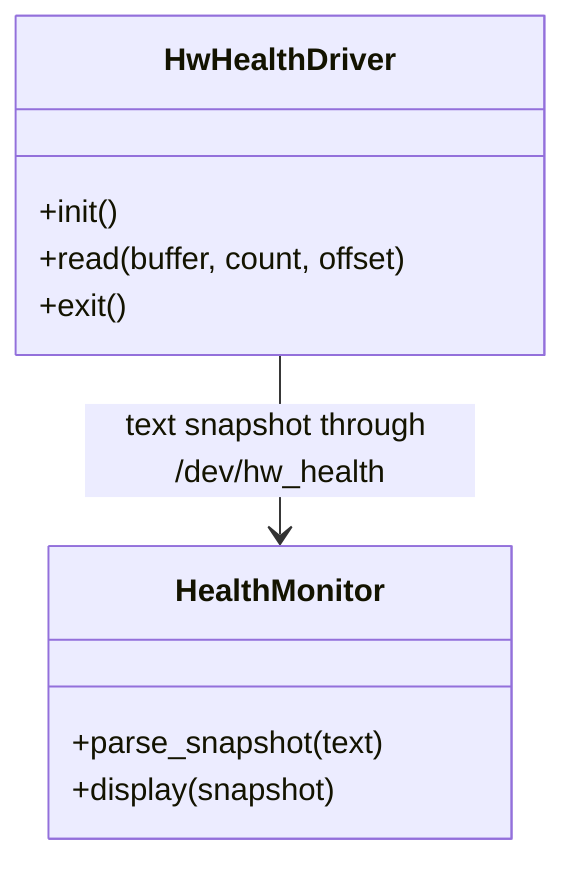
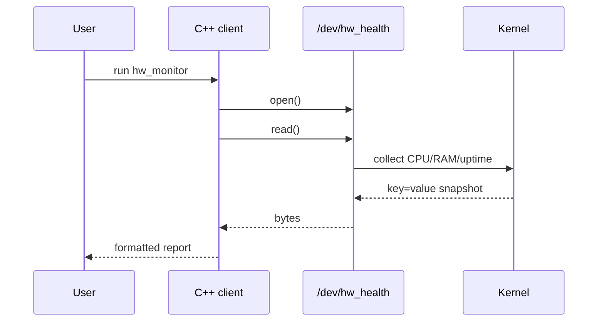
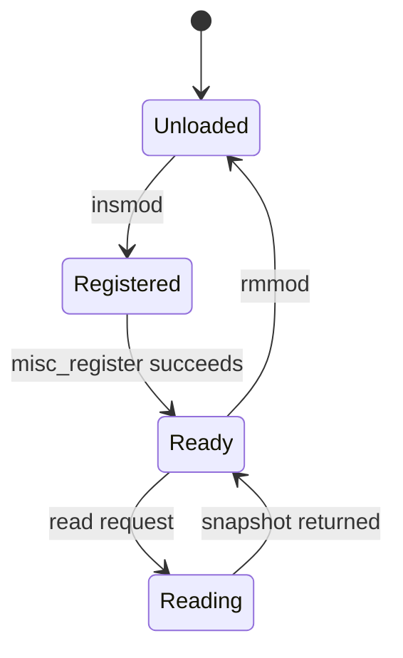

# UML Material

## Class/component view

```mermaid
classDiagram
    class HwHealthDriver {
      +init()
      +read(buffer, count, offset)
      +exit()
    }
    class HealthMonitor {
      +parse_snapshot(text)
      +display(snapshot)
    }
    HwHealthDriver --> HealthMonitor : text snapshot through /dev/hw_health
```

## Sequence view

```mermaid
sequenceDiagram
    participant User
    participant App as C++ client
    participant Device as /dev/hw_health
    participant Kernel
    User->>App: run hw_monitor
    App->>Device: open()
    App->>Device: read()
    Device->>Kernel: collect CPU/RAM/uptime
    Kernel-->>Device: key=value snapshot
    Device-->>App: bytes
    App-->>User: formatted report
```

## State machine

```mermaid
stateDiagram-v2
    [*] --> Unloaded
    Unloaded --> Registered: insmod
    Registered --> Ready: misc_register succeeds
    Ready --> Reading: read request
    Reading --> Ready: snapshot returned
    Ready --> Unloaded: rmmod
```

